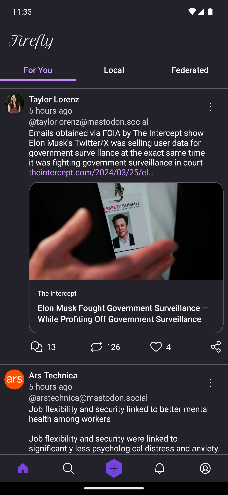
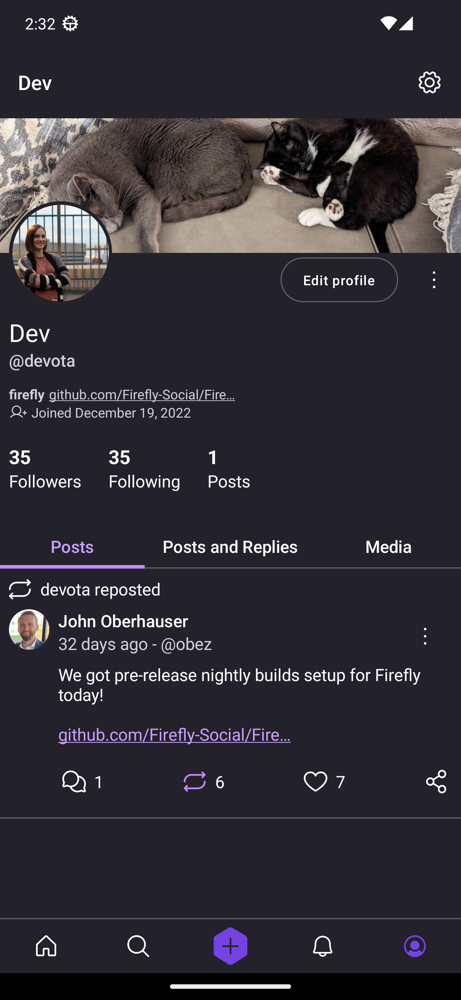

# Firefly
A [Mastodon](https://joinmastodon.org/) client for Android, implemented with Jetpack Compose
## Try it out 
- [Download an APK](https://github.com/Firefly-Social/Firefly/releases) from our latest pre-release
- Build and install from source using Android Studio

|Feed|Profile|Search|
|--|--|--|
||||

## Features Roadmap
- Custom emojis
- Multi-account login
- Bookmarks screen
- Localization

This is a continuation of the cancelled [Mozilla Social Android](https://github.com/MozillaSocial/mozilla-social-android) app by the devs that built it.
Firefly is not associated with Mozilla.
